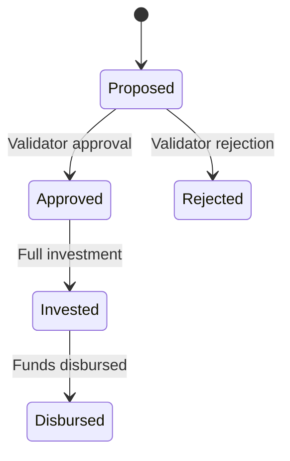

# Loan Management System API

A Go-based microservice for managing loans and investments, built with:
- Gin web framework
- PostgreSQL database
- Redis caching
- JWT authentication

## Product Requirements and Implementation
For requirements see `docs/Amartha_Code_Test_Engineering.pdf` problem #3 or `docs/requirement`

For flow drafts see `docs/plantuml.txt`, paste this into [PlantUML](https://www.plantuml.com/plantuml/uml)

Self Added Requirements and Assumptions:
-------------------
1. New State: Rejected - rejected is when a proposed loan is rejected by field validator
    a. a disproved must contains several information:
        i. the reason for rejection
        ii. the employee id of the staff that rejected the loan
        iii. date of rejection
    b. once disproved it can not go back to proposed state or approved state
2. Timestamps for approval and disbursed are generated automatically by the system.
3. Agreement docs are generated during the proposal flow and can be accessed via a URL (dummy).
4. The agreement docs will be printed and signed by the borrower during disbursement, which will then be scanned and linked on the disbursement api

## Features
- Full loan lifecycle management (Proposed → Approved/Rejected → Invested → Disbursed)
- Role-based access control (Borrower, Validator, Investor)
- State transition validation
- PDF agreement generation
- Investment tracking system

## State Management


## Requirements
- Postgresl (any postgres can work, but i recommend [Postgres-app](https://postgresapp.com/) for newer user due to the easy gui)
- Database browser (ie. [Dbeaver](https://dbeaver.io/))
- [Go ~1.24.1](https://go.dev/doc/install)
- [Redis](https://redis.io/docs/latest/operate/oss_and_stack/install/archive/install-redis/)

## API Documentation

- If user is specified in the API, then you are required to signin as that role to obtain user token before executing the request
- All user data (ID) will be derived from token

### User Roles
| Username  | Role.       | Description                           |
|-----------|-------------|---------------------------------------|
| borrower1 | Borrower    | Users who apply for loans             |
| validator | Validator   | Staff who approve/reject loan applications |
| investor1 | Investor    | Users who invest in approved loans    |
| disburser | Disburser   | Field officers who disburse funds     |

### Sample Users
```sql
INSERT INTO users (id, username, role, created_at, updated_at) VALUES
('1', 'borrower1', 1, NOW(), NOW()),
('2', 'validator', 2, NOW(), NOW()),
('3', 'investor1', 3, NOW(), NOW()),
('4', 'investor2', 3, NOW(), NOW()),
('5', 'disburser', 4, NOW(), NOW());
```


### Authentication Endpoint
```http
POST /users/signin
Content-Type: application/json

{
  "username": "borrower1",
}

Response:
{
    "data": {
        "token": "eyJhbGciOiJ.....",
        "user": {
            "id": 2,
            "created_at": "2025-06-13T22:42:38.303787+07:00",
            "updated_at": "2025-06-13T22:42:38.303787+07:00",
            "username": "validator",
            "role": 2
        }
    }
}
```

### Loan Endpoints

#### Create Loan (Borrower)
```http
POST /loans
Authorization: Bearer {token}
Content-Type: application/json

{
  "principal": 200,
  "rate": 5,
  "roi": 7
}

Response (201 Created):
{
    "data": {
        "id": 7,
        "created_at": "2025-06-14T08:33:25.029724+07:00",
        "updated_at": "2025-06-14T08:33:25.034689+07:00",
        "borrower_id": 1,
        "principal": 200,
        "rate": 5,
        "roi": 7,
        "status": "proposed",
        "agreement_link": "https://example.com/loans/7/agreement/loan_proposal_7.pdf",
        "investments": null
    }
}
```

#### Reject Loan (Validator)
```http
POST /loans/reject
Authorization: Bearer {token}
Content-Type: application/json

{
  "loan_id": 3,
  "reject_reason": "Incomplete documents"
}

Response (200 OK):
{
    "data": {
        "id": 4,
        "created_at": "2025-06-14T09:24:20.368455+07:00",
        "updated_at": "2025-06-14T09:24:20.368455+07:00",
        "loan_id": 3,
        "validator_id": 2,
        "reject_reason": "Incomplete documents",
        "photo_url": "",
        "approved_at": "0001-01-01T00:00:00Z"
    }
}
```

#### Approve Loan (Validator)
```http
POST /loans/approve
Authorization: Bearer {token}
Content-Type: application/json

{
  "loan_id": 4,
  "photo_url": "http://example.com/photo2.jpg"
}

Response (200 OK):
{
    "data": {
        "id": 5,
        "created_at": "2025-06-14T09:26:57.633886+07:00",
        "updated_at": "2025-06-14T09:26:57.633886+07:00",
        "loan_id": 4,
        "validator_id": 2,
        "photo_url": "http://example.com/photo2.jpg",
        "approved_at": "2025-06-14T09:26:57.633867+07:00"
    }
}
```

#### Add Investment (Investor)
```http
POST /loans/invest
Authorization: Bearer {token}
Content-Type: application/json

{
  "loan_id": 4,
  "amount": 50
}

Response (200 OK):
{
    "data": {
        "id": 6,
        "created_at": "2025-06-14T09:37:55.464513+07:00",
        "updated_at": "2025-06-14T09:37:55.464513+07:00",
        "loan_id": 4,
        "investor_id": 3,
        "amount": 50
    }
}
```

#### Get Loan Details
```http
GET /loans/{id}
Authorization: Bearer {token}

Response (200 OK):
{
    "data": {
        "id": 7,
        "created_at": "2025-06-14T08:33:25.029724+07:00",
        "updated_at": "2025-06-14T08:33:25.034689+07:00",
        "borrower_id": 1,
        "principal": 200,
        "rate": 5,
        "roi": 7,
        "status": "proposed",
        "agreement_link": "https://example.com/loans/7/agreement/loan_proposal_7.pdf",
        "investments": []
    }
}
```

#### Disburse Loan (Disburser)
```http
POST /loans/disburse
Authorization: Bearer {token}
Content-Type: application/json

{
  "loan_id": 4,
  "signed_agreement_url": "http://example.com/agreement.pdf"
}

Response (200 OK):
{
    "data": {
        "id": 2,
        "created_at": "2025-06-14T09:39:42.444331+07:00",
        "updated_at": "2025-06-14T09:39:42.444331+07:00",
        "loan_id": 4,
        "signed_agreement_url": "http://example.com/agreement.pdf",
        "disburser_id": 5,
        "disbursed_at": "2025-06-14T09:39:42.444316+07:00"
    }
}
```

### Error Codes
| Code | Status  | Description                     |
|------|---------|---------------------------------|
| 401  | UNAUTHORIZED | Missing/invalid JWT token       |
| 403  | FORBIDDEN | Insufficient permissions        |
| 404  | NOT FOUND | Loan not found                 |
| 422  | UNPROCESSABLE | Invalid state transition      |

## Installation
```bash
# 1. Clone repository
git clone https://github.com/piroxi/loan-system.git

# 2. Install dependencies
go mod tidy

# 3. Run the postgres and create a database

# 4  Run Redis

# 5. Set up configuration (see below)

# 6. Run application
go run server/main.go

# 7. Optional: Import the postman collection to test the APIs. if you do, please create/use an environment
```

## Configuration
Create `.env` file in server directory:
```env
DB_HOST=localhost
DB_PORT=5432
DB_USER=postgres
DB_PASS=postgres
DB_NAME=loans
REDIS_HOST=localhost
REDIS_PORT=6379
AUTH_SECRET=your_jwt_secret_here
```
Adjust the credentials as to your postgresql and redis credentials

## Project Structure
```
server/
├── docs/         # Requirement and design documents
├── entity/       # Database models
├── handler/      # HTTP handlers
├── usecase/      # Business logic
├── utils/        # Shared utilities
│   ├── auth/     # JWT authentication
│   ├── config/   # Environment configuration
│   └── logger/   # Logging setup
├── main.go       # Application entrypoint
└── migration.sql # Database schema
└── postman.json  # Postman collection
```

## Dependencies
- Web Framework: Gin v1.10.1
- ORM: GORM v1.30.0
- Database: PostgreSQL
- Cache: Redis v9.10.0
- Auth: JWT v5.2.2